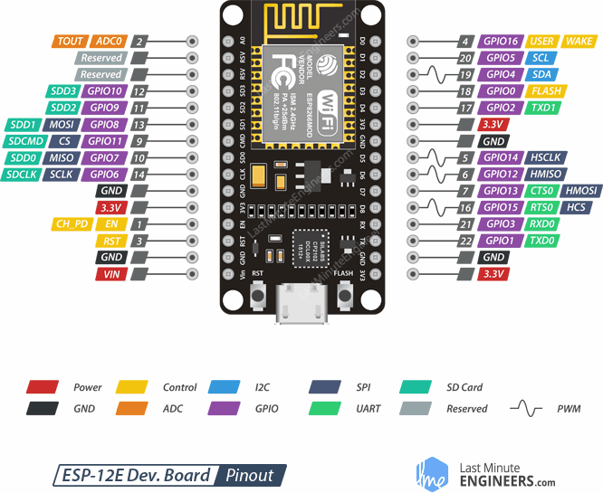

## Setup
* Pip install `ampy` and `esptool`
* Download the [CiricutPython3 Packages](https://github.com/adafruit/Adafruit_CircuitPython_Bundle/releases/download/20190909/adafruit-circuitpython-bundle-3.x-mpy-20190909.zip)
* Download the [CircuitPython ESP8266 bin](https://github.com/adafruit/circuitpython/releases/download/3.1.2/adafruit-circuitpython-feather_huzzah-3.1.2.bin)
* Check that `AMPY_PORT` in `.ampy` matches whatever port the board is using.
* Create `wifi_info.py` in `sensor/src`. Define `SSID` and `PASSWORD`

##### Option 1 -- Quick setup
  * Edit `sensor/install.py`
    * Change `BIN_FILE` and `PACKAGE_DIR` to match the paths to the Packages and bin file you just downloaded.
  * Run `python sensor/install.py --flash --update_libs`
    * When ready to deploy use the `-d` flag.

##### Option 2 -- Manual setup
  * Flash
    1. Run `esptool.py -p $PORT erase_flash`
    2. Run `esptool.py -p $PORT write_flash --flash_size=detect -fm dio 0 $BIN_FILE_NAME`
        * `-fm dio` is required for some NodeMCU boards

  * Move Packages
    * Run `ampy mkdir lib`
    * For each package run:
    `ampy put path_to_packages/package_name lib/package_name`

  * Move Source Files
  *. For each source file run:
      `ampy put path_to_src_file`

  * Reset
    * `ampy reset`

  * Run Test Script
    * `ampy run sensor/test.py`

  * Deployment
    * `ampy put sensor/src/_main.py main.py`
    * `ampy reset`

## Wiring
| bme680 | ESP8266 |
|--------|---------|
| VIN    | 3v3     |
| GND    | GND     |
| SCK    | D1 (SCL)|
| SDI    | D2 (SDA)|

| dht11 | ESP8266     |
|-------|-------------|
| VIN   | 3v3         |
| GND   | GND         |
| DATA  | D5 (GPIO14) |

